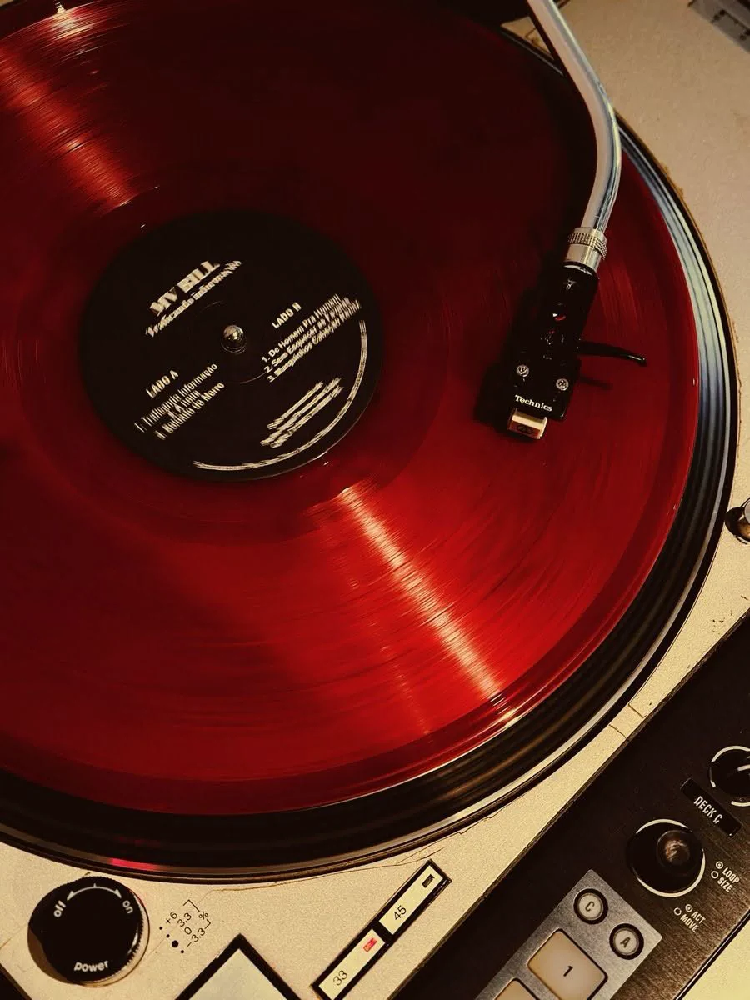

# About stuff 
> Audio Player Software

## Audio decode
I used `FFplay` for the audio, this support fully and Ruby can detect once it gets in the `"System path"`
Just download the `FFplay` online and find a permanent folder for zip extraction. Later you will system path it

## Simple 
This is my Repo about my music player application. I choose Ruby as my main programming language for this since it's very easy to write and read.
Also Ruby needs some more recognition so this is its chance... at least.

### Need::Update()
- [x] FFplay
- []  Red Stone
- []  Art 

[FF Player](https://www.ffmpeg.org/)
